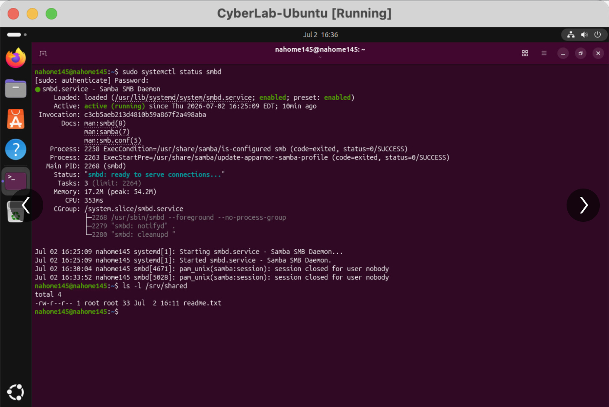
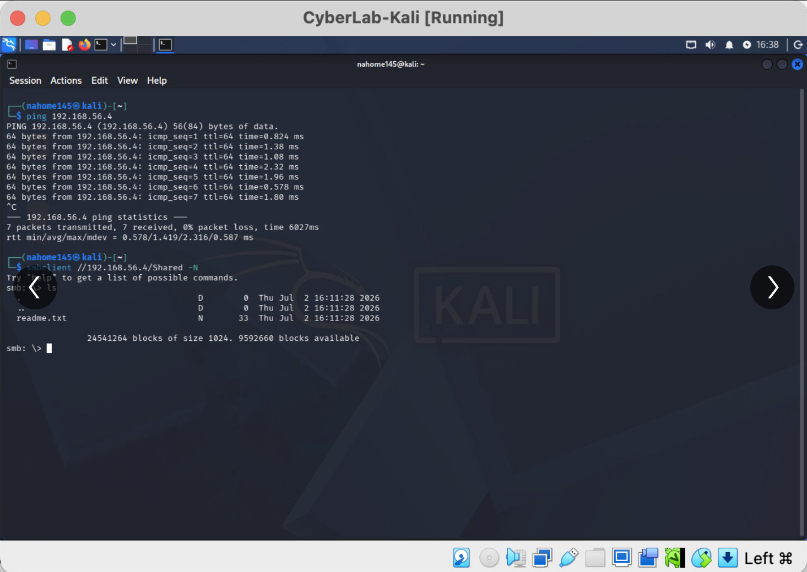

# 📁 Samba File Server Lab

## Project Overview

This project demonstrates the configuration and testing of a Linux file server using Samba.

Ubuntu Server was configured to host an SMB network share, while Kali Linux was used as the client system. The two virtual machines communicated through an isolated VirtualBox network.

## Objectives

- Install and configure Samba on Ubuntu Server
- Create a shared network directory
- Configure SMB file-sharing permissions
- Connect to the share from Kali Linux
- Test network connectivity between virtual machines
- Verify file access and sharing functionality
- Practice Linux and network troubleshooting

## Lab Environment

| Component | Purpose |
| --- | --- |
| Ubuntu Server | Hosted the Samba file server |
| Kali Linux | Connected to and tested the SMB share |
| Samba | Provided SMB file-sharing services |
| VirtualBox | Hosted and connected the virtual machines |
| Host-only network | Provided isolated communication between systems |

## Lab Architecture

- **Ubuntu Server:** Samba server and shared-directory host
- **Kali Linux:** SMB client used to access the share
- **Shared directory:** `/srv/shared`
- **VirtualBox network:** Connected both virtual machines in an isolated environment

## Implementation Process

### 1. Install Samba

Samba was installed on the Ubuntu Server to provide SMB-compatible file-sharing services.

The Samba service was then checked to confirm that it was installed and running properly.

### 2. Create the Shared Directory

A network-sharing directory was created at:

`/srv/shared`

Permissions were configured so authorized systems could access and interact with the directory.

### 3. Configure the Samba Share

The Samba configuration was updated to define the shared resource.

The configuration included:

- Share name
- Directory path
- Access settings
- Read and write permissions
- User or guest-access requirements

The Samba service was restarted after the configuration was updated.

### 4. Configure VirtualBox Networking

The Ubuntu and Kali virtual machines were placed on a compatible VirtualBox network.

Connectivity was verified before attempting to access the file share.

### 5. Connect from Kali Linux

Kali Linux was used as an SMB client to:

- Discover the available share
- Connect to the Ubuntu Samba server
- Browse the shared directory
- Verify successful network authentication or access

### 6. Validate File Sharing

The shared directory was tested to confirm that files could be accessed across the network.

This verified that:

- The Samba service was operational
- The virtual machines could communicate
- The share configuration was valid
- The configured permissions worked correctly

## Troubleshooting Performed

During the lab, network and file-sharing issues were addressed by reviewing:

- VirtualBox network-adapter settings
- IP connectivity between virtual machines
- Samba service status
- Share configuration
- Linux directory permissions
- SMB client connectivity

## Security Considerations

A production Samba server should include:

- Strong authentication
- Least-privilege permissions
- Restricted network access
- Firewall rules limiting SMB traffic
- Regular operating-system and Samba updates
- Logging and monitoring for unauthorized access

## Key Skills Demonstrated

- Linux server administration
- Samba configuration
- SMB file sharing
- Linux file permissions
- VirtualBox networking
- Client-server communication
- Network-connectivity testing
- Service troubleshooting
- Technical documentation

## Key Takeaways
This project strengthened my understanding of Linux file-server administration and client-server networking. It also provided practical experience configuring Samba, managing shared-directory permissions, connecting from a Linux client, and troubleshooting virtual-machine connectivity.

## Lab Evidence

### Ubuntu Samba Server Configuration
The Ubuntu Server was configured to host the `/srv/shared` network directory through Samba.

### Kali Linux SMB Client Validation
Kali Linux successfully connected to the Samba share and verified access to the shared files.

## Ethical Use
All configuration and testing were performed in an isolated home-lab environment using systems I owned and controlled.
